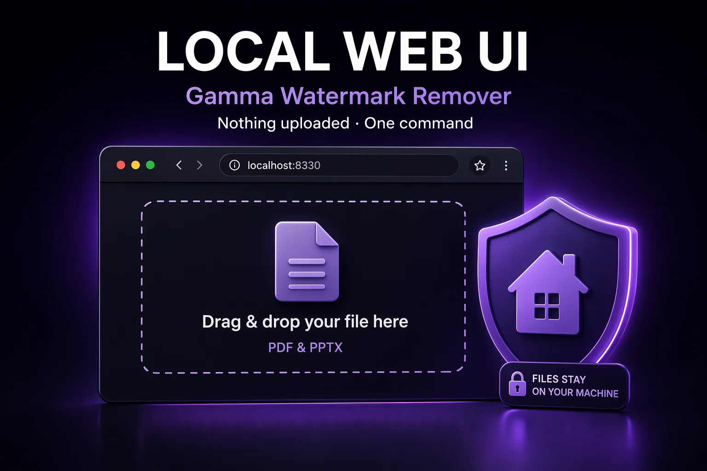

# Gamma Watermark Remover — Local Web UI

[](https://pypi.org/project/gamma-watermark-remover-webui/)
[](LICENSE)
[](https://gammaremover.com)



A **local web tool** to remove the **"Made with Gamma"** watermark from PDF and PowerPoint (.pptx) files exported from [Gamma.app](https://gamma.app). One command starts a drag-and-drop page on `localhost` — your files are processed in memory on your own machine and **never leave it**.

> No Python? No problem — [gammaremover.com](https://gammaremover.com) runs the same engine directly in your browser (WebAssembly, no upload either).

## Quickstart

```bash
pipx install gamma-watermark-remover-webui   # or: pip install gamma-watermark-remover-webui
gamma-watermark-remover-webui
```

Then open **http://127.0.0.1:8330**, drop your exported `.pdf` or `.pptx`, and the cleaned copy downloads automatically with a report of how many watermark objects were removed.

## Why local?

Presentations often contain client names, financials, or unpublished work. Uploading them to a random "watermark remover" server is a real privacy risk. This tool binds to `127.0.0.1` only, keeps files in memory, and writes nothing to disk except your downloaded result.

## How removal works

Powered by the [gamma-watermark-remover](https://github.com/gammaremover/gamma-watermark-remover) library — **structural, lossless deletion**, not repainting:

- **PDF**: the gamma.app link annotation is dropped, and the draw operation of the small bottom-right badge image is removed from the content stream (position-tracked, size-guarded so backgrounds are never touched)
- **PPTX**: the gamma-hyperlinked shape is removed from slide masters/layouts — which is why the badge disappears from every slide at once

Text stays selectable, slides stay editable. If an export flattened the badge into the page image (rare), the UI tells you honestly that a watermark may remain.

## The whole family

| Form | Where |
|------|-------|
| 🌐 In-browser (zero install) | [gammaremover.com](https://gammaremover.com) |
| ⌨️ CLI + Python library | [gamma-watermark-remover](https://github.com/gammaremover/gamma-watermark-remover) |
| 🖥 Local web UI (this repo) | `pipx install gamma-watermark-remover-webui` |
| 🤖 MCP server (Claude & agents) | [gamma-watermark-remover-mcp](https://github.com/gammaremover/gamma-watermark-remover-mcp) |
| 📎 Agent skill (Claude Code / OpenClaw) | [gamma-watermark-remover-skill](https://github.com/gammaremover/gamma-watermark-remover-skill) |

## Responsible use

Only process files you created or have the right to modify. Keep your originals and review cleaned files before sharing. Gamma's official watermark-free route is its [paid plan](https://gammaremover.com/en/blog/gamma-free-vs-pro-watermark/).

## License

MIT
